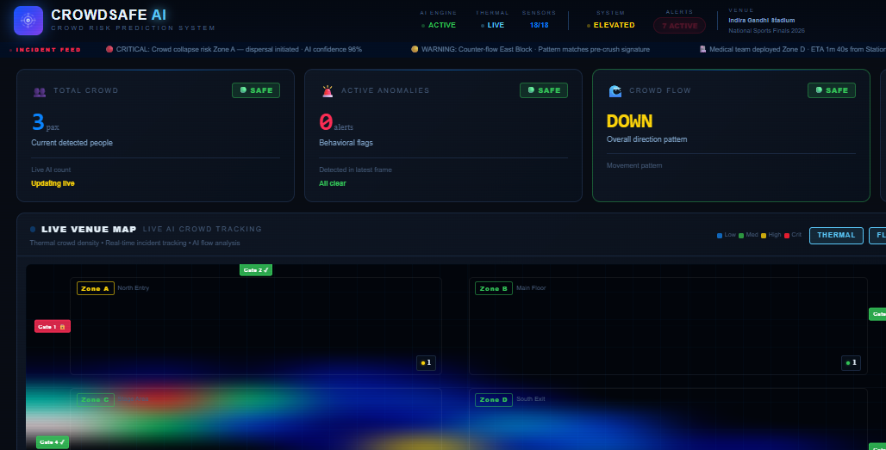
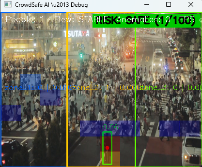
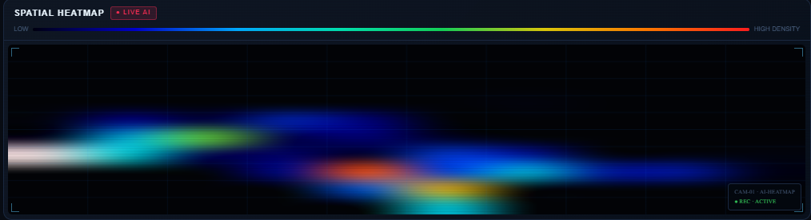
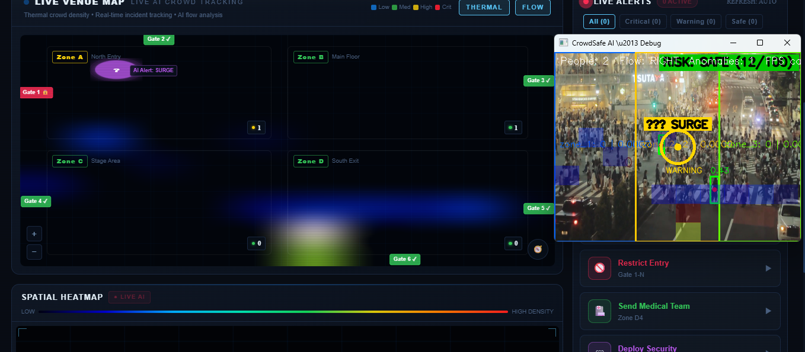

# CrowdSafe AI 🚨

> **Real-time crowd risk prediction system** for CCTV feeds — built for hackathon demo using YOLOv8, OpenCV, FastAPI and RabbitMQ.

---

## 📸 Screenshots

<p align="center">
  
</p>
<p align="center">
  <em>Live Crowd Monitoring Dashboard featuring Total Crowd, Active Anomalies, Crowd Flow, and Live Venue Map.</em>
</p>

<p align="center">
  
</p>
<p align="center">
  <em>AI Pipeline Debug View displaying YOLOv8 tracking and warnings.</em>
</p>

<p align="center">
  
</p>
<p align="center">
  <em>Real-time Spatial Heatmap tracking crowd density distribution.</em>
</p>

<p align="center">
  
</p>
<p align="center">
  <em>Live Venue Map with active tracking alerts.</em>
</p>

---

## 🏗️ Architecture

```
CCTV / Video File
       │
       ▼
┌─────────────────────────────────────────────┐
│              ai-pipeline/                   │
│                                             │
│  VideoCapture → CrowdDetector (YOLOv8n)    │
│       ↓              ↓             ↓        │
│  ZoneManager  FlowTracker  HeatmapGenerator │
│                    └─────────┘              │
│                        ↓                   │
│              BackendPublisher               │
│          (FastAPI POST / RabbitMQ)          │
└─────────────────────────────────────────────┘
       │                    │
       ▼                    ▼
  /backend             /frontend
(Node.js API)      (React Dashboard)
```

---

## 📁 Repository Structure

| Folder | Stack | Description |
|---|---|---|
| `/frontend` | React + Vite + TailwindCSS | Live crowd monitoring dashboard |
| `/backend` | Node.js + Express + Socket.IO | Real-time alert API & WebSocket server |
| `/ai-pipeline` | Python + YOLOv8 + OpenCV | Full computer vision pipeline |
| `/crowd_dataset` | COCO 2017 (val) | Training dataset (person annotations) |

---

## 🤖 AI Pipeline – Modules

| File | Role |
|---|---|
| `config.py` | All parameters in one place (source, FPS, zones, model path) |
| `crowd_detector.py` | YOLOv8n inference — detects persons, returns bboxes + centroids |
| `zone_manager.py` | 3 polygon ROI zones, `cv2.pointPolygonTest`, rolling density avg |
| `flow_tracker.py` | Centroid matching across frames → LEFT/RIGHT/UP/DOWN/STABLE |
| `heatmap_generator.py` | 10×10 accumulating grid, colour overlay renderer |
| `backend_publisher.py` | HTTP POST to FastAPI + RabbitMQ publisher (pika) |
| `main.py` | Orchestrator, CLI flags, built-in `/snapshot` status endpoint |

### Output JSON (per frame)
```json
{
  "timestamp": "2026-02-27T16:34:00+05:30",
  "total_people": 12,
  "zones": {
    "zone_1": { "count": 5, "density": 0.0000162 },
    "zone_2": { "count": 4, "density": 0.0000130 },
    "zone_3": { "count": 3, "density": 0.0000097 }
  },
  "flow_direction": "RIGHT",
  "heatmap_matrix": [[0,1,2,...], ...]
}
```

---

## 🧠 Model Training

The model was **fine-tuned on MS-COCO 2017** (person class only).

| Detail | Value |
|---|---|
| Base model | `yolov8n.pt` (pretrained) |
| Dataset | COCO 2017 val — 2,693 images with person annotations |
| Epochs | 8 |
| Image size | 320×320 |
| Device | Apple M4 (MPS GPU) |
| Trained weights | `runs/detect/crowdsafe_fast/weights/best.pt` |

The pipeline automatically loads `best.pt` (set in `config.py`).

---

## 🚀 How to Run

### Prerequisites
```bash
brew install python@3.12   # Python 3.12 required (PyTorch has no 3.13 wheels yet)
```

### 1. AI Pipeline (Terminal 1)
```bash
cd ai-pipeline
source venv/bin/activate          # activate the Python 3.12 venv

# Run on a local video file
python main.py --source crowd.mp4 --show

# Run on webcam (grant camera permission in System Settings first)
python main.py --source 0 --show

# Run on RTSP stream
python main.py --source rtsp://192.168.1.100/stream
```

**Live snapshot API:** `http://localhost:8000/snapshot`

### 2. Backend (Terminal 2)
```bash
cd backend
npm install
npm run dev
```
*Runs on http://localhost:5000*

### 3. Frontend (Terminal 3)
```bash
cd frontend
npm install
npm run dev
```
*Runs on http://localhost:5173*

---

## ⚙️ Configuration

Edit `ai-pipeline/config.py` to customise:

```python
VIDEO_SOURCE   = "crowd.mp4"          # or 0 for webcam, or RTSP URL
TARGET_FPS     = 15                   # processing FPS cap
MODEL_PATH     = "../runs/detect/crowdsafe_fast/weights/best.pt"
PUBLISHER_MODE = "fastapi"            # "fastapi" | "rabbitmq" | "both"
FASTAPI_URL    = "http://localhost:5000/api/alerts"

# Zone polygons (0.0–1.0 as fraction of frame size)
ZONES_PERCENT = {
    "zone_1": [(0.00, 0.00), (0.33, 0.00), (0.33, 1.00), (0.00, 1.00)],
    "zone_2": [(0.33, 0.00), (0.67, 0.00), (0.67, 1.00), (0.33, 1.00)],
    "zone_3": [(0.67, 0.00), (1.00, 0.00), (1.00, 1.00), (0.67, 1.00)],
}
```

---

## 🔄 Re-train the Model

```bash
cd ai-pipeline
source venv/bin/activate

yolo detect train \
  model=yolov8n.pt \
  data=crowd_dataset.yaml \
  epochs=8 \
  imgsz=320 \
  batch=32 \
  device=mps \
  name=crowdsafe_v2
```

---

## 🛠️ Tech Stack

- **Python 3.12** · **YOLOv8n** (Ultralytics) · **OpenCV** · **NumPy** · **SciPy**
- **FastAPI** · **Uvicorn** · **Pika (RabbitMQ)** · **Requests**
- **Node.js** · **Express** · **Socket.IO**
- **React** · **Vite** · **TailwindCSS**